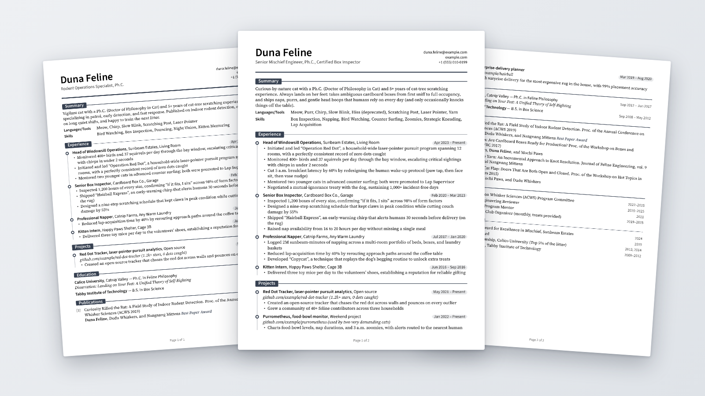
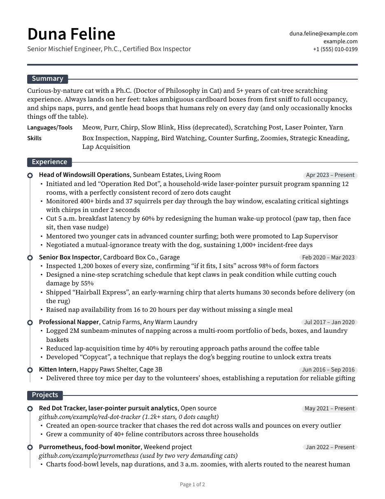
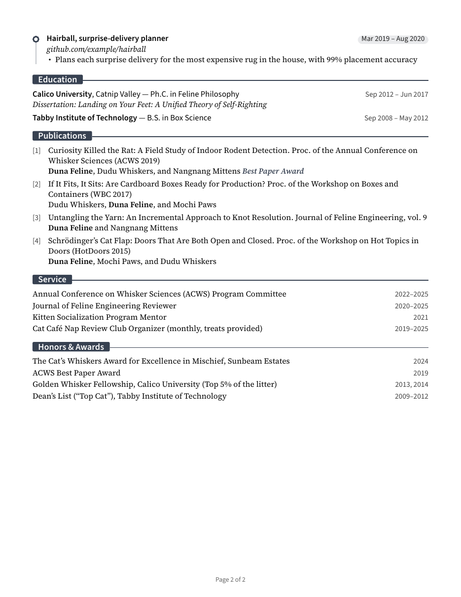
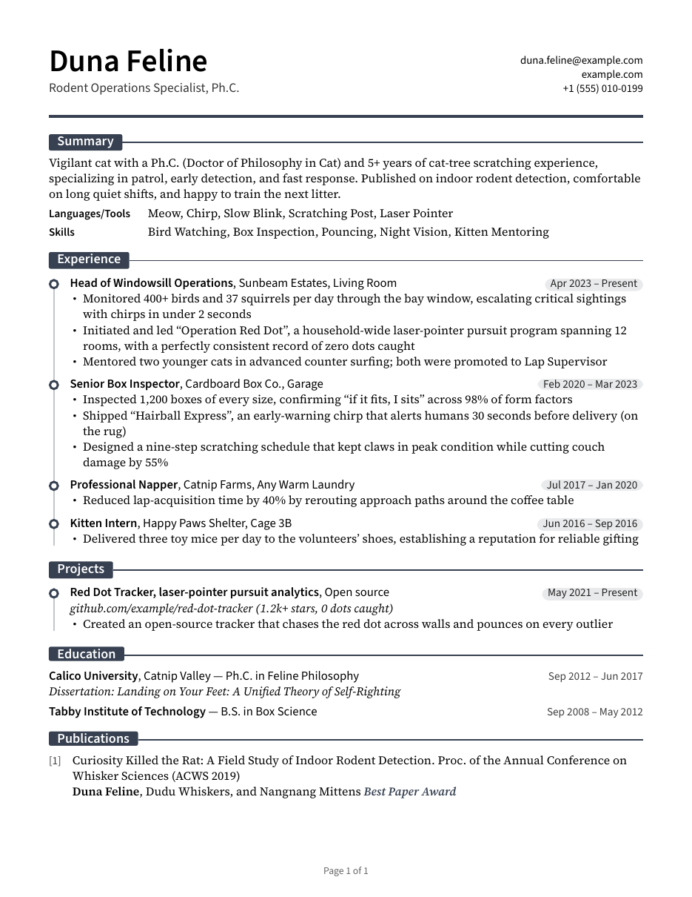
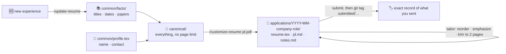

<div align="center">

# 🐾 my-resume

**A résumé you can `git diff`.** One canonical LaTeX resume, tailored variants per job, facts that
can't drift, and a template that is tested like code.

[](https://github.com/h1994st/my-resume/actions/workflows/ci.yml)
[](LICENSE)




</div>

> 🐱 The sample resume belongs to **Duna Feline**, a Senior Mischief Engineer with a Ph.C. (Doctor
> of Philosophy in Cat). Her name blends two real cats, **Du**du and **Na**ngnang; _Feline_ is,
> well, cat. Replace her with yourself in a few files; see [Make it yours](#-make-it-yours).

## ✨ Why this template is different

|                                      |                                                                                                                                                                                                                              |
| ------------------------------------ | ---------------------------------------------------------------------------------------------------------------------------------------------------------------------------------------------------------------------------- |
| 🎨 **Modern, readable design**       | A single column with graphite section tabs, a timeline **spine** that links your roles and keeps flowing across page breaks, date pills, and Source Serif 4 + Source Sans 3 at a comfortable 10.5pt.                         |
| 🧱 **Content-only resume files**     | The class owns the header, layout, and section order. Each `resume.tex` is just your summary, bullets, and a few keys. Drop a section by leaving it out.                                                                     |
| 📚 **Facts live once**               | Job titles, dates, degrees, publications, service, and honors are defined once in `common/facts/` and cited by key. Your name is bolded in author lists automatically. Titles and author lists can't drift between versions. |
| 🚨 **Typos fail the build**          | A wrong key, a missing field, a duplicate section, or an impossible date like `2024-13` stops the build with a message that names it.                                                                                        |
| 📐 **No awkward page breaks**        | Pages break between bullets, never between a role title and its first bullet or a heading and its first entry. A test sweeps 51 page positions to prove it.                                                                  |
| 🎯 **Canonical → tailored workflow** | Keep one complete canonical resume. `just new <company> <role>` snapshots it, with a `jd.md` and a `notes.md` that record why each variant differs.                                                                          |
| 🤖 **Claude Code skills**            | `/customize-resume <JD>` and `/update-resume` run the workflows step by step; `CLAUDE.md` holds the rules (never invent or inflate claims); hooks auto-format and guard the repo.                                            |
| 🔍 **ATS-friendly**                  | Real, selectable text in reading order, plain ASCII hyphens, and a single column.                                                                                                                                            |
| 🧪 **Tested and CI'd**               | 14 template test cases, formatting checks, and every resume built on each push.                                                                                                                                              |

## 📸 Screenshots

|                                   Canonical, page 1                                    |                                   Canonical, page 2                                    |                             Tailored for a job posting                              |
| :------------------------------------------------------------------------------------: | :------------------------------------------------------------------------------------: | :---------------------------------------------------------------------------------: |
| [](docs/images/canonical-1.png) | [](docs/images/canonical-2.png) | [](docs/images/tailored-1.png) |

## 🚀 Quick start

macOS with [Homebrew](https://brew.sh):

```bash
brew bundle          # BasicTeX, just, tex-fmt, prettier, poppler
just deps            # + the extra TeX Live packages (asks for sudo once)
just build           # canonical/resume.tex → canonical/resume.pdf
just check applications/2026-09-granary-senior-mouser   # build + check it fits in 2 pages
just test            # run the template tests
```

| Command                         | What it does                                                             |
| ------------------------------- | ------------------------------------------------------------------------ |
| `just build [dir]`              | Build `<dir>/resume.tex` (default `canonical`)                           |
| `just check [dir] [pages]`      | Build, show layout warnings, assert the page count (variants: at most 2) |
| `just watch [dir]`              | Rebuild on save                                                          |
| `just new <company> <role>`     | Start `applications/YYYY-MM-<company>-<role>/` from canonical            |
| `just test`                     | Template tests: errors, rendering, section order, page breaks            |
| `just fmt` / `just fmt-check`   | Format `.tex` (tex-fmt) and `.md`/`.json` (Prettier)                     |
| `just deps` / `just deps-check` | Install / verify dependencies                                            |

## ✍️ Writing a resume

A resume file is pure content:

```latex
\documentclass{resume}
\headline{Rodent Operations Specialist, Ph.C.}   % optional override of the profile headline

\begin{document}
\begin{summary}
  Vigilant cat with 5+ years of cat-tree scratching experience ...
  \skills{Languages/Tools}{Meow, Chirp, Slow Blink, Laser Pointer}
\end{summary}

\begin{experience}
  \begin{role}{windowsill}            % title, organization, location, dates come from the facts
    \item Monitored 400+ birds and 37 squirrels per day through the bay window ...
  \end{role}
\end{experience}

\education[dissertation]
\publications{feline2019curiosity}
\service{acws-pc, kitten-mentor}
\end{document}
```

Facts are defined once:

```latex
% common/facts/roles.tex
\defrole{windowsill}{
  title = {Head of Windowsill Operations}, org = {Sunbeam Estates}, location = {Living Room},
  start = 2023-04, end = present,
}
```

Sections always print in the same order: Summary, Experience, Projects, Education, Publications,
Service, Honors & Awards.

## 🔁 The workflow



1. **Canonical** is the complete superset of your experience, with no page limit.
2. **Tailored variants** start as a snapshot of canonical. The job description is saved to `jd.md`,
   its requirements are mapped to real evidence, then the resume is reordered, emphasized, and
   trimmed to two pages. `notes.md` records the strategy and every change from canonical.
3. **Submitted variants** are history: tag the commit, and `git checkout <tag> && just build <dir>`
   rebuilds exactly what you sent. PDFs are never committed; the source is the record.

## 🤖 Claude Code

The repo is set up for [Claude Code](https://claude.com/claude-code): rules in
[`CLAUDE.md`](CLAUDE.md), deterministic workflows as skills, and guardrails as hooks.

| Skill                               | What it does                                                                                                                                                                                                                                            |
| ----------------------------------- | ------------------------------------------------------------------------------------------------------------------------------------------------------------------------------------------------------------------------------------------------------- |
| `/customize-resume <JD PDF or URL>` | Runs `just new`, summarizes the posting into `jd.md`, maps 5–8 requirements to your real evidence (and says where there is none), **stops for your approval**, tailors `resume.tex`, checks it fits two pages, and writes a semantic diff to `notes.md` |
| `/update-resume <what changed>`     | Asks for any missing titles or dates, updates `common/facts/` and the canonical resume, flags application snapshots the change touches, then runs the tests and checks                                                                                  |

| Hook                     | Guards                                                |
| ------------------------ | ----------------------------------------------------- |
| ✍️ `format.sh`           | Formats every `.tex`/`.md`/`.json` file Claude edits  |
| 🍺 `protect-brewfile.sh` | The `Brewfile` changes only through `brew bundle add` |

The rules Claude follows: never invent or inflate experience, metrics, or titles; canonical has no
page limit and variants fit two pages; cut content before squeezing fonts or margins.

## 🧪 Tests and CI

`just test` compiles every case in [`tests/cases/`](tests/cases/) and checks what each one declares:

```latex
% expect: error Unknown role key 'pawn'        ← the build must fail with this message
% expect-text: Apr 2023 – Present              ← the PDF must contain this text
% expect-order: Summary | Experience | Service ← sections print in this order
% expect-unstranded: 50                         ← shift content 0..50 lines; no orphaned titles
```

[GitHub Actions](.github/workflows/ci.yml) runs on macOS (the `Brewfile` setup with BasicTeX) and
Linux (TeX Live `scheme-small`, the same subset): it checks formatting, runs the tests, builds every
resume, and uploads the PDFs as artifacts.

## 📁 Layout

```text
common/resume.cls          the template: layout, colour, fonts, section order, commands
common/profile.tex         name, headline, contact details
common/facts/*.tex         roles, projects, education, publications, service, honors
canonical/resume.tex       the complete resume
applications/<dir>/        tailored variants: resume.tex, jd.md, notes.md
templates/application/     jd.md and notes.md skeletons for `just new`
.claude/                   Claude Code skills, hooks, and settings
tests/                     template tests (`just test`)
fonts/                     Source Serif 4 and Source Sans 3 (SIL OFL)
```

## 🐾 Make it yours

1. Use this repo as a template, then clone it.
2. Replace `common/profile.tex` and the files in `common/facts/` with your own details (or run
   `/update-resume` and let Claude ask you for them).
3. Rewrite `canonical/resume.tex`, and the "Technical identity" section of `CLAUDE.md`.
4. Delete `applications/2026-09-granary-senior-mouser/` (or keep it as a reference).
5. Run `just check && just test`.
6. 🔒 Your resume is personal data: keep your copy **private**. PDFs are gitignored, and the
   screenshots in `docs/images/` show Duna, not you.

## 📜 License

[MIT](LICENSE) for the template and tooling. The fonts in `fonts/` are © Adobe under the
[SIL Open Font License 1.1](fonts/SourceSerif4/LICENSE.md).

<div align="center">

_Made with 🐾 by Dudu, Nangnang, and their human._

</div>
